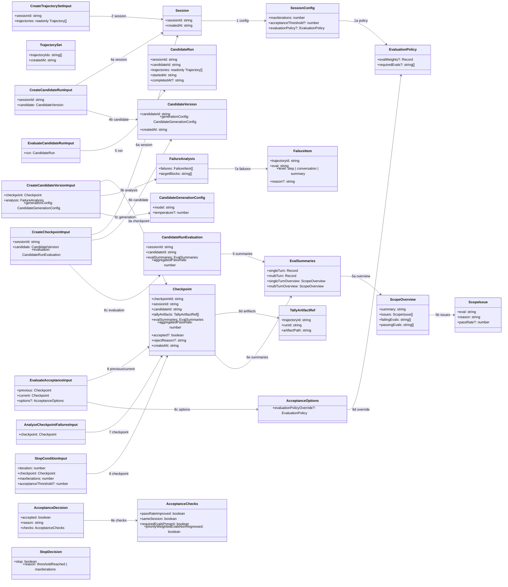

```mermaid
%%{init: {
  "theme": "default",
  "themeVariables": {
    "fontSize": "18px"
  }
}}%%
classDiagram
direction LR

class EvaluationPolicy {
  +evalWeights?: Record<string, number>
  +requiredEvals?: string[]
}

class SessionConfig {
  +maxIterations: number
  +acceptanceThreshold?: number
  +evaluationPolicy?: EvaluationPolicy
}

class Session {
  +sessionId: string
  +createdAt: string
}

class CreateTrajectorySetInput {
  +sessionId: string
  +trajectories: readonly Trajectory[]
}

class TrajectorySet {
  +trajectoryIds: string[]
  +createdAt: string
}

class CreateCandidateVersionInput {
  +checkpoint: Checkpoint
  +analysis: FailureAnalysis
  +generationConfig: CandidateGenerationConfig
}

class CandidateGenerationConfig {
  +model: string
  +temperature?: number
}

class CandidateVersion {
  +candidateId: string
  +generationConfig: CandidateGenerationConfig
  +createdAt: string
}

class ScopeIssue {
  +eval: string
  +reason: string
  +passRate?: number
}

class ScopeOverview {
  +summary: string
  +issues: ScopeIssue[]
  +failingEvals: string[]
  +passingEvals: string[]
}

class EvalSummaries {
  +singleTurn: Record<EvalName, EvalSummary>
  +multiTurn: Record<EvalName, EvalSummary>
  +singleTurnOverview: ScopeOverview
  +multiTurnOverview: ScopeOverview
}

class CreateCandidateRunInput {
  +sessionId: string
  +candidate: CandidateVersion
}

class CandidateRun {
  +sessionId: string
  +candidateId: string
  +trajectories: readonly Trajectory[]
  +startedAt: string
  +completedAt?: string
}

class EvaluateCandidateRunInput {
  +run: CandidateRun
}

class CandidateRunEvaluation {
  +sessionId: string
  +candidateId: string
  +evalSummaries: EvalSummaries
  +aggregatedPassRate: number
}

class CreateCheckpointInput {
  +sessionId: string
  +candidate: CandidateVersion
  +evaluation: CandidateRunEvaluation
}

class TallyArtifactRef {
  +trajectoryId: string
  +runId: string
  +artifactPath: string
}

class Checkpoint {
  +checkpointId: string
  +sessionId: string
  +candidateId: string
  +tallyArtifacts: TallyArtifactRef[]
  +evalSummaries: EvalSummaries
  +aggregatedPassRate: number
  +accepted?: boolean
  +rejectReason?: string
  +createdAt: string
}

class AnalyzeCheckpointFailuresInput {
  +checkpoint: Checkpoint
}

class FailureItem {
  +trajectoryId: string
  +eval: string
  +level: step | conversation | summary
  +reason?: string
}

class FailureAnalysis {
  +failures: FailureItem[]
  +targetBlocks: string[]
}

class AcceptanceOptions {
  +evaluationPolicyOverride?: EvaluationPolicy
}

class EvaluateAcceptanceInput {
  +previous: Checkpoint
  +current: Checkpoint
  +options?: AcceptanceOptions
}

class AcceptanceChecks {
  +passRateImproved: boolean
  +sameSession: boolean
  +requiredEvalsPresent: boolean
  +priorityWeightedEvalsNonRegressed: boolean
}

class AcceptanceDecision {
  +accepted: boolean
  +reason: string
  +checks: AcceptanceChecks
}

class StopConditionInput {
  +iteration: number
  +checkpoint: Checkpoint
  +maxIterations: number
  +acceptanceThreshold?: number
}

class StopDecision {
  +stop: boolean
  +reason: thresholdReached | maxIterations
}

Session --> SessionConfig : 1 config
SessionConfig --> EvaluationPolicy : 1a policy
CreateTrajectorySetInput --> Session : 2 session
CreateCandidateVersionInput --> Checkpoint : 3a checkpoint
CreateCandidateVersionInput --> FailureAnalysis : 3b analysis
CreateCandidateVersionInput --> CandidateGenerationConfig : 3c generation
CreateCandidateRunInput --> Session : 4a session
CreateCandidateRunInput --> CandidateVersion : 4b candidate
EvaluateCandidateRunInput --> CandidateRun : 5 run
CandidateRunEvaluation --> EvalSummaries : 5 summaries
EvalSummaries --> ScopeOverview : 5a overview
ScopeOverview --> ScopeIssue : 5b issues
CreateCheckpointInput --> Session : 6a session
CreateCheckpointInput --> CandidateVersion : 6b candidate
CreateCheckpointInput --> CandidateRunEvaluation : 6c evaluation
Checkpoint --> TallyArtifactRef : 6d artifacts
Checkpoint --> EvalSummaries : 6e summaries
AnalyzeCheckpointFailuresInput --> Checkpoint : 7 checkpoint
FailureAnalysis --> FailureItem : 7a failures
EvaluateAcceptanceInput --> Checkpoint : 8 previous/current
EvaluateAcceptanceInput --> AcceptanceOptions : 8c options
AcceptanceOptions --> EvaluationPolicy : 8d override
AcceptanceDecision --> AcceptanceChecks : 8e checks
StopConditionInput --> Checkpoint : 9 checkpoint
```