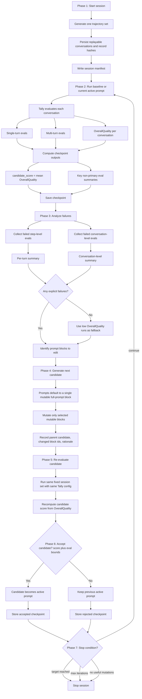

# HRPO v3 Architecture Graph

## Reading Guide

- Core rule: `session -> fixed trajectory set -> candidate prompt -> Tally evaluation -> aggregated score -> mutate prompt -> run again`
- Tally is the source of truth, with step-level, conversation-level, and final `OverallQuality` outputs per conversation
- Primary scalar objective: `OverallQuality`
- Candidate score: mean `OverallQuality` across completed conversations in the fixed session set
- Candidate acceptance is not determined by that scalar alone; key non-primary evals must remain within allowed bounds
- Failure analysis uses failed step-level and conversation-level evals; if none exist, it falls back to low `OverallQuality` runs
- Other evals do not create a second blended score; selected eval outcomes act as explicit acceptance conditions
- Prompt mutation defaults to a single mutable `full-prompt` block
- Checkpoints are plain iteration snapshots, not a separate heavy abstraction
- Buckets are execution partitions only, not scoring boundaries
- `Session manifest`, `checkpoint record`, and acceptance gates are supporting machinery around the main loop
