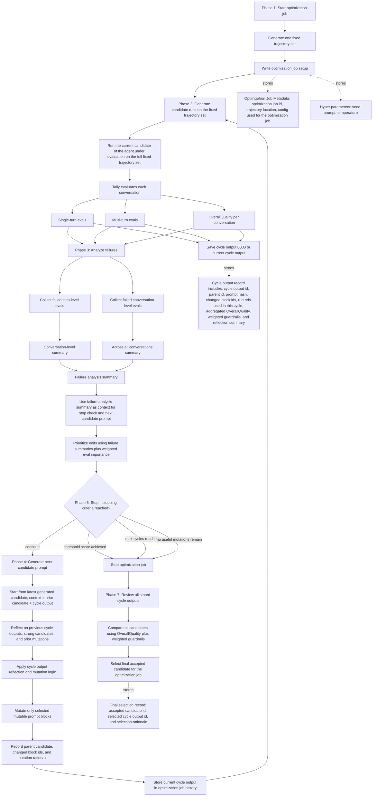

# HRPO v4 Architecture Graph

## Reading Guide

- Core rule: `agent under evaluation -> fixed trajectory set -> Tally evaluation -> aggregated score -> stop check -> generate next candidate -> store cycle outputs -> loop or final selection`
- The fixed trajectory set is created once per optimization job, then reused across all cycles
- The optimization job setup now separates `Optimization Job Metadata` from `Hyper parameters`
- `Optimization Job Metadata` explicitly stores `optimization job id`, `trajectory location`, and the `config used for the optimization job`
- `Hyper parameters` explicitly store `seed prompt` and `temperature`
- Tally remains the source of truth, with step-level, conversation-level, and final `OverallQuality` outputs per conversation
- Phase 3 reads **single-turn, multi-turn, and OverallQuality** results directly from Tally; there is no separate “cycle outputs” aggregation box before analysis (candidate score, guardrails, and weights are still derived from those same layers for persistence)
- Primary scalar objective: `OverallQuality`
- Candidate score: mean `OverallQuality` across completed conversations in the fixed trajectory set for the optimization job
- Initial evaluation produces cycle output `0000`, and later cycle outputs remain plain cycle snapshots rather than a separate heavy abstraction
- Weighted evals are explicit: more important evals influence mutation priority, regression checks, and final selection more strongly while optimizing the agent under evaluation
- Failure analysis rolls the step-level and conversation-level summaries into the **failure analysis summary**, which informs the stop check, mutation priority, and the next candidate prompt (and is persisted with the cycle output)
- The candidate reads the runs used for the current cycle as readonly context; generating a new candidate does not modify those runs
- Cycle output records explicitly include `cycle output id`, `parent id`, `prompt hash`, `changed block ids`, run refs used in the cycle, aggregated `OverallQuality`, weighted guardrails, and reflection summary
- Candidate generation uses the latest generated candidate plus cycle output (including failure analysis) as context; APIs reserve parent and history fields for future lookback even when the implementation always starts from the latest candidate today
- Prompt mutation still defaults to a single mutable `full-prompt` block, with selective refinement happening inside that simple block model
- Stopping is loop control only: when the threshold is reached, `k` cycles are exhausted, or no useful mutations remain, candidate generation ends and the optimization job moves to final selection
- The loop is explicit: Phase 2 generate candidate runs on the fixed trajectory set -> Phase 3 analyze -> **Phase 6 stop or continue** -> Phase 4 generate next candidate prompt -> store current cycle output -> Phase 2 again, or exit to Phase 7
- Stop when the stopping criteria are reached
- Final acceptance happens once, after the optimization job stops, by comparing all stored candidates and choosing the best-performing one under the configured guardrails
