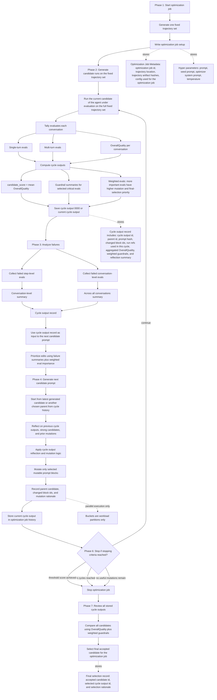

# HRPO v4 Architecture Graph

## Reading Guide

- Core rule: `agent under evaluation -> fixed trajectory set -> Tally evaluation -> aggregated score -> optimizer generates next candidate -> store cycle outputs -> stop -> select final candidate`
- The fixed trajectory set is created once per optimization job, then reused across all cycles
- The optimization job setup now separates `Optimization Job Metadata` from `Hyper parameters`
- `Optimization Job Metadata` explicitly stores `optimization job id`, `trajectory location`, `trajectory artifact hashes`, and the `config used for the optimization job`
- `Hyper parameters` explicitly store `prompt`, `seed prompt`, `optimizer system prompt`, and `temperature`
- Tally remains the source of truth, with step-level, conversation-level, and final `OverallQuality` outputs per conversation
- Primary scalar objective: `OverallQuality`
- Candidate score: mean `OverallQuality` across completed conversations in the fixed trajectory set for the optimization job
- Initial evaluation produces cycle output `0000`, and later cycle outputs remain plain cycle snapshots rather than a separate heavy abstraction
- Weighted evals are explicit: more important evals influence mutation priority, regression checks, and final selection more strongly while optimizing the agent under evaluation
- Failure analysis rolls the step-level and conversation-level summaries into the cycle output record, which then becomes the input to the next candidate prompt
- The candidate reads the runs used for the current cycle as readonly context; generating a new candidate does not modify those runs
- Cycle output records explicitly include `cycle output id`, `parent id`, `prompt hash`, `changed block ids`, run refs used in the cycle, aggregated `OverallQuality`, weighted guardrails, and reflection summary
- Candidate generation starts from the latest generated candidate, or another chosen parent from cycle history, and includes cycle output reflection over prior cycle outputs and mutation history so the optimizer does not repeat work or re-break earlier fixes
- Prompt mutation still defaults to a single mutable `full-prompt` block, with selective refinement happening inside that simple block model
- Stopping is loop control only: when the threshold is reached, `k` cycles are exhausted, or no useful mutations remain, candidate generation ends and the optimization job moves to final selection
- The loop is explicit: Phase 2 generate candidate runs on the fixed trajectory set -> Phase 3 analyze -> Phase 4 generate next candidate prompt -> store current cycle output -> Phase 6 stop or continue
- Stop when the stopping criteria are reached
- Final acceptance happens once, after the optimization job stops, by comparing all stored candidates and choosing the best-performing one under the configured guardrails
- Buckets are workload partitions for parallel execution only, not scoring groups or optimization boundaries
