# HRPO v4 Architecture Graph

```mermaid
flowchart TD
    A[Phase 1: Start optimization job] --> B[Generate one fixed trajectory set]
    B --> C[Persist replayable conversation artifacts]
    C --> D[Record hashes for frozen artifacts]
    D --> E[Write optimization job setup]
    E --> F[Phase 2: Run baseline or current active candidate of the agent under evaluation]
    F --> G[Run the agent under evaluation on the full fixed trajectory set for the optimization job]
    G --> H[Tally evaluates each conversation]

    H --> J1[Single-turn evals]
    H --> J2[Multi-turn evals]
    H --> J3[OverallQuality per conversation]

    J1 --> K[Compute cycle outputs]
    J2 --> K
    J3 --> K

    K --> L1[candidate_score = mean OverallQuality]
    K --> L2[Guardrail summaries for selected critical evals]
    K --> L3[Weighted evals: more important evals have higher mutation and acceptance priority]
    L1 --> M[Save cycle output 0000 or current cycle output]
    L2 --> M
    L3 --> M

    M --> N[Phase 3: Analyze failures]
    N --> O[Collect failed step-level evals]
    N --> P[Collect failed conversation-level evals]
    O --> Q[Conversation-level summary]
    P --> R[Across all conversations summary]
    Q --> S{Any explicit failures?}
    R --> S
    S -->|Yes| T[Identify high-priority prompt blocks to edit]
    S -->|No| U[Use low OverallQuality runs as fallback analysis input]
    U --> T
    T --> V[Prioritize edits using failure summaries plus weighted eval importance]

    V --> W[Phase 4: Generate next candidate]
    W --> X[Start from last accepted candidate of the agent under evaluation]
    X --> Y[Reflect on previous cycle outputs, accepted fixes, rejected changes, and prior mutations]
    Y --> Z[Apply cycle output reflection and mutation logic]
    Z --> AA[Mutate only selected mutable prompt blocks]
    AA --> AB[Record parent candidate, changed block ids, and mutation rationale]

    AB --> AC[Phase 5: Re-evaluate candidate]
    AC --> AD[Run new candidate of the agent under evaluation on the same fixed trajectory set for the optimization job]
    AD --> AE[Use same Tally configuration]
    AE --> AF[Recompute candidate_score from OverallQuality]
    AF --> AG[Compare against current accepted cycle output]
    AD -.parallel execution only.-> AV[Buckets are workload partitions only]

    AG --> AH{Phase 6: Accept candidate?}
    AH -->|Check 1| AI[candidate_score >= baseline_score + min_delta]
    AH -->|Check 2| AJ[Optimization job identity, frozen artifacts, and hashes still match]
    AH -->|Check 3| AK[Important weighted guardrails stay within allowed tolerance]

    AI --> AL{All checks pass?}
    AJ --> AL
    AK --> AL

    AL -->|Yes| AM[Candidate of the agent under evaluation becomes new active version]
    AL -->|No| AN[Keep previous active version of the agent under evaluation]
    AM --> AO[Store accepted cycle output and update baseline]
    AN --> AP[Store rejected cycle output for auditability]

    AO --> AQ{Phase 7: Stop if threshold score achieved or k cycles reached?}
    AP --> AQ
    AQ -->|threshold score achieved| AR[Stop optimization job]
    AQ -->|k cycles reached| AR
    AQ -->|continue| N

    E -.stores.-> AS[Optimization Job Metadata: optimization job id, trajectory location, conversation artifact hashes, config used for the optimization job]
    E -.stores.-> AU[Hyper parameters: prompt, baseline prompt or current active agent under evaluation, temperature]
    M -.stores.-> AT[Cycle output record includes: cycle output id, parent id, prompt hash, changed block ids, Tally refs, aggregated OverallQuality, weighted guardrails, reflection summary, accept or reject decision]
```

## Reading Guide

- Core rule: `agent under evaluation -> fixed trajectory set -> Tally evaluation -> aggregated score -> optimizer generates next candidate -> re-run agent under evaluation`
- The fixed trajectory and replayable conversation artifacts are created once per optimization job, then frozen and reused across all cycles
- The optimization job setup now separates `Optimization Job Metadata` from `Hyper parameters`
- `Optimization Job Metadata` explicitly stores `optimization job id`, `trajectory location`, `conversation artifact hashes`, and the `config used for the optimization job`
- `Hyper parameters` explicitly store `prompt`, `baseline prompt or current active agent under evaluation`, and `temperature`
- Tally remains the source of truth, with step-level, conversation-level, and final `OverallQuality` outputs per conversation
- Primary scalar objective: `OverallQuality`
- Candidate score: mean `OverallQuality` across completed conversations in the fixed trajectory set for the optimization job
- Baseline evaluation produces cycle output `0000`, and later cycle outputs remain plain cycle snapshots rather than a separate heavy abstraction
- Weighted evals are explicit: more important evals influence mutation priority, regression checks, and acceptance more strongly while optimizing the agent under evaluation
- Failure analysis uses failed step-level and conversation-level evals; if none exist, it falls back to low `OverallQuality` runs as analysis input only
- Cycle output records explicitly include `cycle output id`, `parent id`, `prompt hash`, `changed block ids`, `Tally refs`, aggregated `OverallQuality`, weighted guardrails, reflection summary, and the accept/reject decision
- Candidate generation starts from the last accepted candidate of the agent under evaluation and includes cycle output reflection over prior cycle outputs, accepted fixes, rejected changes, and mutation history so the optimizer does not repeat work or re-break earlier fixes
- Prompt mutation still defaults to a single mutable `full-prompt` block, with selective refinement happening inside that simple block model
- Acceptance requires all three checks together: score improvement over `baseline_score + min_delta`, frozen artifact/hash consistency within the optimization job, and important weighted guardrails staying within allowed tolerance
- The loop is explicit: Phase 3 analyze -> Phase 4 generate -> Phase 5 re-evaluate -> Phase 6 accept or reject -> Phase 7 stop or continue
- Stop when either the threshold score is achieved or `k` cycles are reached
- Accepted candidates of the agent under evaluation become the new active baseline; rejected candidates are still stored for auditability
- Buckets are workload partitions for parallel execution only, not scoring groups or optimization boundaries
