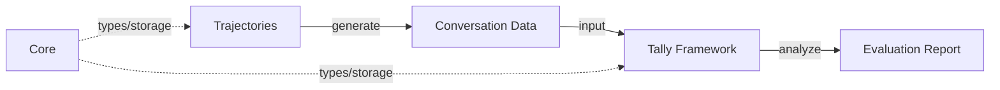

Welcome to the Tally documentation. Tally is a modular ecosystem for building, testing, and evaluating LLM-based agents.

## Core Packages

<Cards>
  <Card 
    title="Tally (Evaluation)" 
    description="The main evaluation framework for metrics, scorers, and automated reports." 
    href="/docs/tally" 
  />
  <Card 
    title="Trajectories (Generation)" 
    description="Simulate multi-turn conversations and generate test data for evaluation." 
    href="/docs/trajectories" 
  />
  <Card 
    title="Core (Foundation)" 
    description="Shared types, storage adapters, and common utilities used across packages." 
    href="/docs/core" 
  />
</Cards>

## How it Works

The Tally ecosystem is designed to work together to provide a seamless evaluation workflow.



1. **Generate**: Use `@tally-evals/trajectories` to simulate realistic, multi-turn conversations with your agents.
2. **Evaluate**: Feed those conversations into `@tally-evals/tally` to measure performance using LLM-based metrics and custom scorers.
3. **Iterate**: Analyze the generated reports to identify failure modes and improve your agent.

## Quick Start

To get started with the entire ecosystem:

```bash
pnpm add @tally-evals/tally @tally-evals/trajectories @tally-evals/core
```

Explore the documentation for each package using the tabs in the sidebar.
