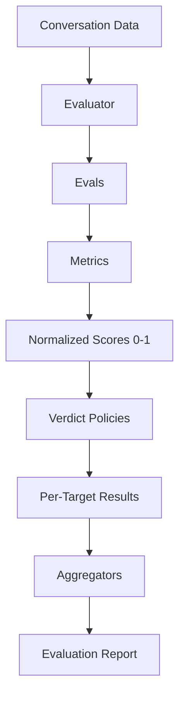

## Mental Model

Tally is built on the principle of **composability by value**. Unlike other frameworks that rely on string IDs for metrics and scorers, Tally uses actual JavaScript objects that you can pass around, wrap, and extend.

| Concept | Purpose |
| :--- | :--- |
| **MetricDef** | Defines *what* to measure (e.g., an LLM prompt or a regex check). |
| **Metric** | The actual result produced by a MetricDef (normalized to 0-1). |
| **Scorer** | Combines multiple Metrics into a single derived score. |
| **Eval** | Combines a Metric/Scorer with a **Verdict Policy** (pass/fail). |
| **Evaluator** | Orchestrates a set of Evals against specific targets in a conversation. |
| **Aggregator** | Summarizes results across the entire dataset (e.g., pass rate). |

## Data Flow



### Composability

Because every component is a first-class object, you can easily share metrics across different evaluators or create higher-order evaluators that wrap existing ones.

```ts
const relevance = createAnswerRelevanceMetric({ provider });
const completeness = createCompletenessMetric({ provider });

// Re-use metrics in different evals
const fastEval = defineSingleTurnEval({ name: 'Fast', metric: relevance });
const deepEval = defineScorerEval({ 
  name: 'Deep', 
  inputs: [relevance, completeness],
  scorer: weightedScorer 
});
```
