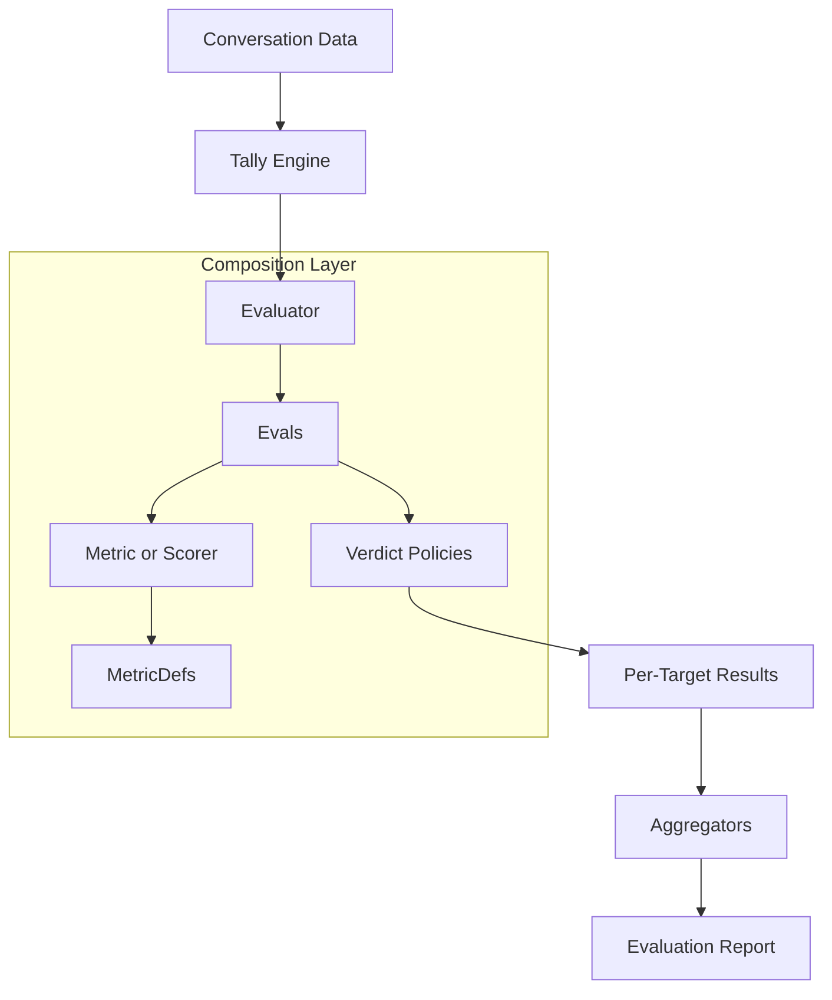

## Mental Model

Tally is primarily an **Evaluation Engine**. Instead of providing a rigid set of fixed tests, it provides the infrastructure to define and run your own domain-based evaluation measures. 

To promote maximum reusability and composability, Tally enforces a strict differentiation between measurement, combination, and decision-making.

## Building Blocks

Tally is composed of several fundamental building blocks that you combine together to form an evaluation pipeline.

| Block | Analogy | Purpose |
| :--- | :--- | :--- |
| **MetricDef** | **Ruler & Blueprint** | Defines *what* to measure (e.g., an LLM prompt or a regex check). It is the definition/blueprint for a metric. |
| **Metric** | **Measurement** | The actual result produced by a MetricDef (can be numeric, boolean, ordinal, etc.). |
| **Scorer** | **Normalizer/Combiner** | Combines multiple metric results into a unified score (usually 0–1) based on weights. |
| **Eval** | **Decision Rule** | Combines a Metric or Scorer with a **Verdict Policy** to determine if the result "passes" or "fails." |
| **Evaluator** | **Orchestrator** | Groups related Evals together and defines the execution policy for targets. |
| **Aggregator** | **Statistician** | Summarizes individual results into dataset-level statistics (e.g., Mean, Pass Rate). |
| **Report** | **Scorecard** | The final structured output for analysis, visualization, and CI/CD. |

## The Composability Trio

The power of Tally comes from how the first three blocks (Metric, Scorer, Eval) separate their responsibilities.

### 1. Metrics (Measurement)
Focuses exclusively on capturing raw domain data. A metric only cares about measuring one specific quality (e.g., response time, keyword presence, or LLM-graded relevance).

### 2. Scorers (Combination)
Focuses exclusively on how to weigh and normalize multiple measurements. Because scorers are distinct from metrics, you can reuse the same metric in different scoring contexts.

### 3. Evals (Decision)
Focuses exclusively on the business rules. An eval takes the output of your measures and applies a **Verdict Policy**. You can use the same scoring measures but apply a strict verdict for production and a loose one for experiments.

## Core Architecture

Tally acts as the orchestrator that combines these building blocks together against your data.

