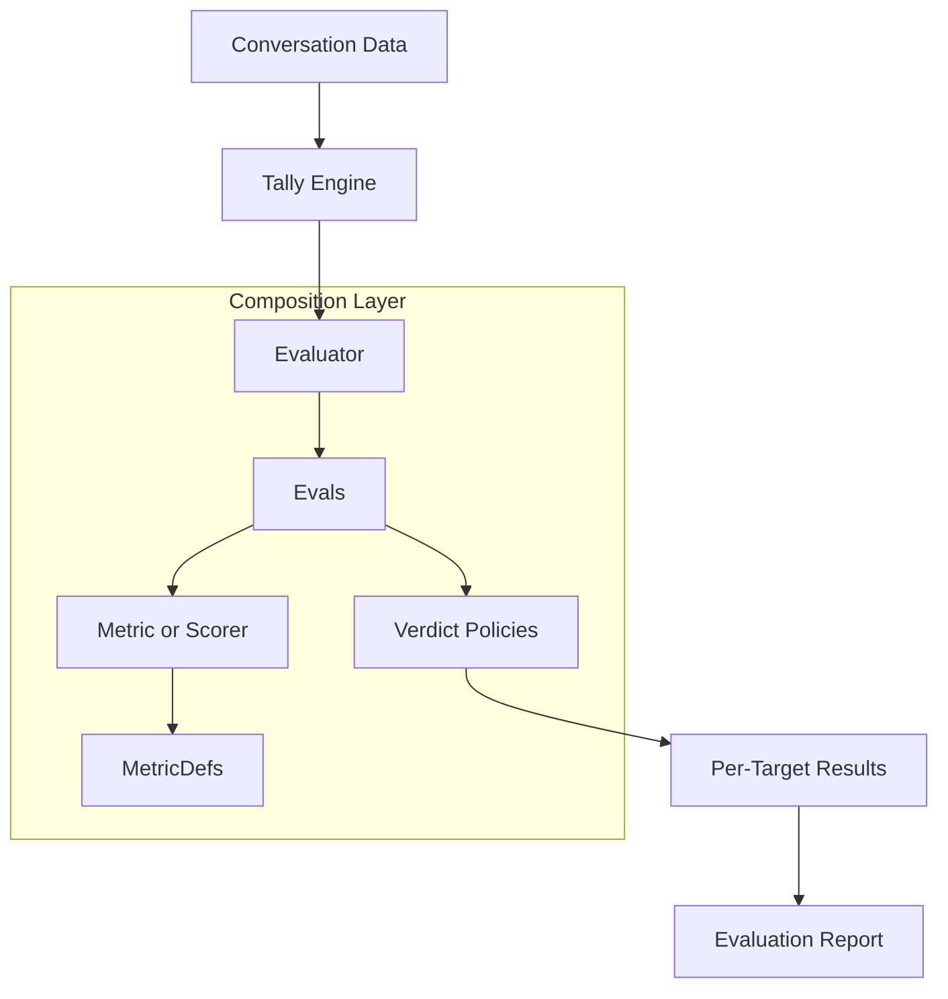

import { CodePopover } from '@/components/CodePopover';

export const metricDefTsDef = String.raw`export type MetricDef<
  TRawValue extends MetricScalar = MetricScalar,
  TContainerData extends MetricContainer = MetricContainer,
> =
  | SingleTurnMetricVariants<
      TRawValue,
      TContainerData extends SingleTurnContainer
        ? TContainerData
        : SingleTurnContainer
    >
  | (TContainerData extends MultiTurnContainer
      ? MultiTurnMetricVariants<TRawValue, TContainerData>
      : never);
`;

export const metricDefExample = String.raw`import { createSingleTurnCode, defineBaseMetric } from '@tally-evals/tally'

const length = defineBaseMetric({ name: 'answerLength', valueType: 'number' })

const answerLength = createSingleTurnCode({
  name: 'Answer Length',
  output: length,
  run: ({ output }) => ({ value: output[0]?.content.length ?? 0 }),
})`;

export const metricTsDef = String.raw`export interface Metric<TRawValue extends MetricScalar = MetricScalar> {
  metricDef: MetricDef<TRawValue, MetricContainer>;
  value: TRawValue;
  confidence?: number;
  reasoning?: string;
  executionTime: number;
  timestamp: Date;
  metadata?: Record<string, unknown>;
}
`;

export const metricExample = String.raw`const m: Metric<number> = {
  metricDef: relevance,
  value: 0.82,
  executionTime: 123,
  timestamp: new Date(),
}`;

export const scorerTsDef = String.raw`export interface Scorer<
  TInputs extends readonly ScorerInput[] = readonly ScorerInput[],
> {
  name: string;
  description?: string;
  output: BaseMetricDef<number>;
  inputs: TInputs;
  normalizeWeights?: boolean;
  combineScores?: (scores: InputScores<TInputs>) => Score;
  fallbackScore?: Score;
  metadata?: Record<string, unknown>;
}
`;

export const scorerExample = String.raw`import { createWeightedAverageScorer, defineInput } from '@tally-evals/tally/scorers'

const scorer = createWeightedAverageScorer({
  name: 'OverallQuality',
  output: overallMetric,
  inputs: [
    defineInput({ metric: relevance, weight: 0.6 }),
    defineInput({ metric: toolAccuracy, weight: 0.4 }),
  ],
})`;

export const evalTsDef = String.raw`export interface SingleTurnEval<
  TContainer extends SingleTurnContainer,
  TMetricValue extends MetricScalar = MetricScalar,
> {
  kind: 'singleTurn';
  name: string;
  metric: MetricDef<TMetricValue, TContainer>;
  verdict?: VerdictPolicyFor<TMetricValue>;
}

export interface MultiTurnEval<
  TContainer extends MultiTurnContainer,
  TMetricValue extends MetricScalar = MetricScalar,
> {
  kind: 'multiTurn';
  name: string;
  metric: MetricDef<TMetricValue, TContainer>;
  verdict?: VerdictPolicyFor<TMetricValue>;
}

export interface ScorerEval {
  kind: 'scorer';
  name: string;
  inputs: readonly (SingleTurnMetricDef<any, any> | MultiTurnMetricDef<any, any>)[];
  scorer: Scorer;
  verdict?: VerdictPolicyFor<number>;
}
`;

export const evalExample = String.raw`import { defineSingleTurnEval, thresholdVerdict } from '@tally-evals/tally'

const evalDef = defineSingleTurnEval({
  name: 'Answer Relevance',
  metric: relevance,
  verdict: thresholdVerdict(0.7),
})`;

export const evaluatorTsDef = String.raw`export interface Evaluator<TContainer extends MetricContainer> {
  name: string;
  description?: string;
  evals: readonly Eval<TContainer>[];
  context: EvaluationContext;
  metadata?: Record<string, unknown>;
}
`;

export const evaluatorExample = String.raw`import { createEvaluator, runAllTargets } from '@tally-evals/tally'

const evaluator = createEvaluator({
  name: 'Agent Quality',
  evals: [relevanceEval],
  context: runAllTargets(),
})`;

export const reportTsDef = String.raw`export interface EvaluationReport {
  runId: string;
  timestamp: Date;
  perTargetResults: PerTargetResult[];
  aggregateSummaries: AggregateSummary[];
  evalSummaries: Map<
    string,
    {
      evalName: string;
      evalKind: 'singleTurn' | 'multiTurn' | 'scorer';
      aggregations: BuiltInAggregations;
      verdictSummary?: {
        passRate: Score;
        failRate: Score;
        passCount: number;
        failCount: number;
        totalCount: number;
      };
    }
  >;
  metadata: Record<string, unknown>;
}
`;

export const reportExample = String.raw`const report = await tally.run()

console.log(report.evalSummaries)
console.log(report.perTargetResults[0]?.verdicts)`;

## Mental Model

Tally is primarily an **Evaluation Engine**. Instead of providing a rigid set of fixed tests, it provides the infrastructure to define and run your own domain-based evaluation measures. 

To promote maximum reusability and composability, Tally enforces a strict differentiation between measurement, combination, and decision-making.

## Building Blocks

Tally is composed of several fundamental building blocks that you combine together to form an evaluation pipeline.

| Block | Analogy | Purpose | Code |
| :--- | :--- | :--- | :---: |
| [**MetricDef**](/docs/tally/metrics/custom) | **Ruler & Blueprint** | Defines *what* to measure (e.g., an LLM prompt or a regex check). It is the definition/blueprint for a metric. | <CodePopover title="MetricDef (core)" tsDef={metricDefTsDef} example={metricDefExample} /> |
| [**Metric**](/docs/tally/metrics) | **Measurement** | The actual result produced by a MetricDef (can be numeric, boolean, ordinal, etc.). | <CodePopover title="Metric (runtime result)" tsDef={metricTsDef} example={metricExample} /> |
| [**Scorer**](/docs/tally/scorers) | **Normalizer/Combiner** | Combines multiple metric results into a unified score (usually 0–1) based on weights. | <CodePopover title="Scorer (core)" tsDef={scorerTsDef} example={scorerExample} /> |
| [**Eval**](/docs/tally/evals) | **Decision Rule** | Combines a Metric or Scorer with a **Verdict Policy** to determine if the result "passes" or "fails." | <CodePopover title="Eval (single-turn / multi-turn / scorer)" tsDef={evalTsDef} example={evalExample} /> |
| [**Evaluator**](/docs/tally/evals) | **Orchestrator** | Groups related Evals together and defines the execution policy for targets. | <CodePopover title="Evaluator (core)" tsDef={evaluatorTsDef} example={evaluatorExample} /> |
| [**Report**](/docs/tally/reports) | **Scorecard** | The final structured output for analysis, visualization, and CI/CD. | <CodePopover title="EvaluationReport (core)" tsDef={reportTsDef} example={reportExample} /> |

## The Composability Trio

The power of Tally comes from how the first three blocks (Metric, Scorer, Eval) separate their responsibilities.

### 1. Metrics (Measurement)
Focuses exclusively on capturing raw domain data. A metric only cares about measuring one specific quality (e.g., response time, keyword presence, or LLM-graded relevance).

### 2. Scorers (Combination)
Focuses exclusively on how to weigh and normalize multiple measurements. Because scorers are distinct from metrics, you can reuse the same metric in different scoring contexts.

### 3. Evals (Decision)
Focuses exclusively on the business rules. An eval takes the output of your measures and applies a **Verdict Policy**. You can use the same scoring measures but apply a strict verdict for production and a loose one for experiments.

## Core Architecture

Tally acts as the orchestrator that combines these building blocks together against your data.

## API Reference

For detailed type definitions and factory functions, see:

- [Metrics API](/docs/tally/reference/metric) — `defineBaseMetric`, `createSingleTurnCode`, `createSingleTurnLLM`, etc.
- [Scorers API](/docs/tally/reference/scorers) — `defineScorer`, `createWeightedAverageScorer`, `defineInput`
- [Evals API](/docs/tally/reference/evals) — `defineSingleTurnEval`, `defineMultiTurnEval`, `defineScorerEval`
- [Reports API](/docs/tally/reference/reports) — `TallyRunReport`, `TallyRunArtifact`
